# Family Todo App Architecture

This document provides a comprehensive overview of the Family Todo App architecture, explaining how HTML, JavaScript, Rust, and WebAssembly components interact to create a modern web application.

## Overview

The Family Todo App is built using a hybrid architecture that combines:
- **Frontend**: Vanilla JavaScript with modular class-based design
- **Backend Logic**: Rust compiled to WebAssembly (WASM)
- **UI Layer**: Semantic HTML with component-based CSS
- **Data Exchange**: JSON serialization between JS and WASM

## High-Level Architecture

```mermaid
graph TB
    subgraph Browser["🌐 Browser Environment"]
        subgraph Frontend["Frontend Layer"]
            HTML["`📄 **index.html**
            Semantic markup
            Form inputs
            Modal dialogs`"]
            
            CSS["`🎨 **styles.css**
            Component-based styles
            Responsive design
            Visual states`"]
            
            JS["`⚡ **app.js**
            TodoAppController class
            Event handling
            DOM manipulation`"]
        end
        
        subgraph WASM["WebAssembly Layer"]
            RUST["`🦀 **Rust (lib.rs)**
            TodoItem struct
            TodoApp logic
            Business rules`"]
            
            BINDINGS["`🔗 **WASM Bindings**
            Generated JS glue
            Type conversions
            Memory management`"]
        end
        
        subgraph Storage["Browser Storage"]
            LOCALSTORAGE["`💾 **localStorage**
            UI state persistence
            Collapsed groups`"]
        end
    end
    
    HTML --> JS
    CSS --> HTML
    JS <--> BINDINGS
    BINDINGS <--> RUST
    JS <--> LOCALSTORAGE
    
    style Frontend fill:#e1f5fe
    style WASM fill:#fff3e0
    style Storage fill:#f3e5f5
```

## Component Architecture

### Frontend Components

```mermaid
graph LR
    subgraph "Frontend Architecture"
        subgraph "HTML Structure"
            FORM["`📝 **Todo Form**
            Task input
            Assignee select
            Date picker`"]
            
            FILTERS["`🔍 **Filter Section**
            Filter button
            Status display
            Modal trigger`"]
            
            LIST["`📋 **Todo List**
            Date groups
            Todo items
            Action buttons`"]
            
            MODAL["`🗂️ **Filter Modal**
            Assignee filter
            Status filter
            Date range`"]
        end
        
        subgraph "CSS Modules"
            BASE["`🏗️ **Base Styles**
            Layout
            Typography
            Colors`"]
            
            COMPONENTS["`🧩 **Components**
            Buttons
            Forms
            Cards`"]
            
            INTERACTIVE["`🎭 **Interactive**
            Hover states
            Animations
            Transitions`"]
        end
        
        subgraph "JavaScript Controller"
            CONTROLLER["`🎮 **TodoAppController**
            App initialization
            State management
            Event coordination`"]
            
            CRUD["`📝 **CRUD Operations**
            Add todo
            Edit todo
            Toggle completion`"]
            
            RENDER["`🖼️ **Rendering**
            DOM updates
            List generation
            State reflection`"]
            
            EVENTS["`⚡ **Event Handling**
            User interactions
            Form submissions
            Modal controls`"]
        end
    end
    
    FORM --> CONTROLLER
    FILTERS --> CONTROLLER
    LIST --> CONTROLLER
    MODAL --> CONTROLLER
    
    CONTROLLER --> CRUD
    CONTROLLER --> RENDER
    CONTROLLER --> EVENTS
    
    BASE --> COMPONENTS
    COMPONENTS --> INTERACTIVE
```

### Backend (WASM) Architecture

```mermaid
graph TB
    subgraph "Rust/WASM Backend"
        subgraph "Data Models"
            TODOITEM["`📦 **TodoItem**
            id: u32
            text: String
            assignee: String
            date: String
            completed: bool`"]
            
            METHODS["`🛠️ **TodoItem Methods**
            new()
            toggle_completion()
            update()
            date_group_key()`"]
        end
        
        subgraph "Application Logic"
            TODOAPP["`🏢 **TodoApp**
            todos: Vec<TodoItem>
            next_id: u32`"]
            
            PUBLIC["`🌐 **Public API**
            add_todo()
            toggle_todo()
            edit_todo()
            get_todos_json()`"]
            
            PRIVATE["`🔒 **Private Helpers**
            find_todo_by_id_mut()
            group_todos_by_date()
            sort_date_groups()
            compare_todos()`"]
        end
        
        subgraph "WASM Interface"
            BINDGEN["`🔗 **wasm-bindgen**
            #[wasm_bindgen] macros
            JS type conversion
            Memory management`"]
            
            SERDE["`📊 **Serialization**
            JSON encoding/decoding
            Rust ↔ JS data transfer
            Type safety`"]
        end
    end
    
    TODOITEM --> METHODS
    TODOAPP --> PUBLIC
    TODOAPP --> PRIVATE
    PUBLIC --> BINDGEN
    PRIVATE --> SERDE
    METHODS --> SERDE
    
    style TODOITEM fill:#ffebee
    style TODOAPP fill:#e8f5e8
    style BINDGEN fill:#fff3e0
```

## Data Flow Patterns

### User Action Flow

### Filter Operation Flow

### State Management Flow

## Technology Integration

### WASM-JavaScript Bridge

```mermaid
graph LR
    subgraph "JavaScript Side"
        JSAPP["`🟨 **JS TodoController**
        Class instance
        Method calls
        Event handling`"]
        
        JSDATA["`📊 **JavaScript Data**
        JSON strings
        DOM elements
        Event objects`"]
    end
    
    subgraph "WASM Bridge"
        GLUE["`🔗 **Generated Glue Code**
        Type conversions
        Memory management
        Error handling`"]
        
        SERIALIZATION["`📦 **Serialization Layer**
        serde_json
        String ↔ Struct
        Type safety`"]
    end
    
    subgraph "Rust Side"
        RUSTAPP["`🦀 **Rust TodoApp**
        Business logic
        Data validation
        State management`"]
        
        RUSTDATA["`🗃️ **Rust Data**
        TodoItem structs
        Vec<TodoItem>
        Strong typing`"]
    end
    
    JSAPP <--> GLUE
    JSDATA <--> SERIALIZATION
    GLUE <--> RUSTAPP
    SERIALIZATION <--> RUSTDATA
    
    style JSAPP fill:#fff3c4
    style GLUE fill:#e8f5e8
    style RUSTAPP fill:#ffebee
```

### Build Process

```mermaid
graph TD
    subgraph "Development"
        RUST_SRC["`📝 **src/lib.rs**
        Rust source code
        Business logic
        Tests`"]
        
        FRONTEND_SRC["`🌐 **Frontend Files**
        index.html
        app.js
        styles.css`"]
    end
    
    subgraph "Build Tools"
        WASMPACK["`📦 **wasm-pack**
        Rust → WASM compiler
        Generates JS bindings
        Type definitions`"]
        
        CARGO["`🦀 **Cargo**
        Dependency management
        Testing framework
        Linting (clippy)`"]
    end
    
    subgraph "Generated Output"
        WASM_FILES["`⚙️ **pkg/ directory**
        .wasm binary
        .js glue code
        .d.ts types`"]
        
        DIST["`🚀 **Deployable App**
        Static files
        Ready for serving
        Browser compatible`"]
    end
    
    RUST_SRC --> WASMPACK
    RUST_SRC --> CARGO
    WASMPACK --> WASM_FILES
    FRONTEND_SRC --> DIST
    WASM_FILES --> DIST
    
    style WASMPACK fill:#fff3e0
    style DIST fill:#e8f5e8
```

## Performance Considerations

### Memory Management

```mermaid
graph TB
    subgraph "Memory Architecture"
        subgraph "JavaScript Heap"
            JSHEAP["`🟨 **JS Objects**
            DOM elements
            Event handlers
            Controller instance`"]
        end
        
        subgraph "WASM Linear Memory"
            WASMHEAP["`🦀 **Rust Heap**
            TodoItem vectors
            String allocations
            Temporary objects`"]
        end
        
        subgraph "Shared Interface"
            BRIDGE["`🔗 **Memory Bridge**
            String passing
            JSON serialization
            Automatic cleanup`"]
        end
    end
    
    JSHEAP <--> BRIDGE
    BRIDGE <--> WASMHEAP
    
    style JSHEAP fill:#fff3c4
    style WASMHEAP fill:#ffebee
    style BRIDGE fill:#e8f5e8
```

### Data Transfer Optimization

- **Minimal Data Transfer**: Only JSON strings cross the WASM boundary
- **Batch Operations**: Group multiple todos in single JSON response
- **Client-Side Filtering**: Reduce WASM calls by filtering in JavaScript
- **Efficient Serialization**: Use serde for fast JSON encoding/decoding

## Testing Strategy

```mermaid
graph LR
    subgraph "Testing Pyramid"
        subgraph "Unit Tests"
            RUST_UNIT["`🦀 **Rust Unit Tests**
            TodoItem methods
            TodoApp logic
            Pure functions`"]
        end
        
        subgraph "Integration Tests"
            WASM_TESTS["`🔗 **WASM Tests**
            JS ↔ WASM interface
            JSON serialization
            Browser environment`"]
        end
        
        subgraph "End-to-End"
            BROWSER_TESTS["`🌐 **Browser Tests**
            User interactions
            Full workflow
            UI validation`"]
        end
    end
    
    RUST_UNIT --> WASM_TESTS
    WASM_TESTS --> BROWSER_TESTS
    
    style RUST_UNIT fill:#ffebee
    style WASM_TESTS fill:#fff3e0
    style BROWSER_TESTS fill:#e3f2fd
```

## Development Workflow

For mid-level engineers working on this codebase:

1. **Rust Changes**: Modify `src/lib.rs` → Run `cargo test` → `wasm-pack build`
2. **Frontend Changes**: Modify `app.js`/`styles.css` → Refresh browser
3. **Full Rebuild**: `wasm-pack build --target web` → Test in browser
4. **Testing**: `cargo test && wasm-pack test --node`

## Key Design Decisions

### Why WASM for Todo Logic?
- **Performance**: Faster execution for complex sorting/filtering
- **Type Safety**: Rust's strong typing prevents runtime errors
- **Maintainability**: Clear separation between business logic and UI
- **Scalability**: Easy to add complex features without JavaScript complexity

### Why Vanilla JavaScript?
- **Simplicity**: No framework overhead for a focused application
- **Control**: Direct DOM manipulation for optimal performance
- **Learning**: Demonstrates core web technologies without abstractions
- **Size**: Minimal bundle size for fast loading

This architecture provides a solid foundation for a maintainable, performant todo application while demonstrating modern web development patterns with WASM integration.